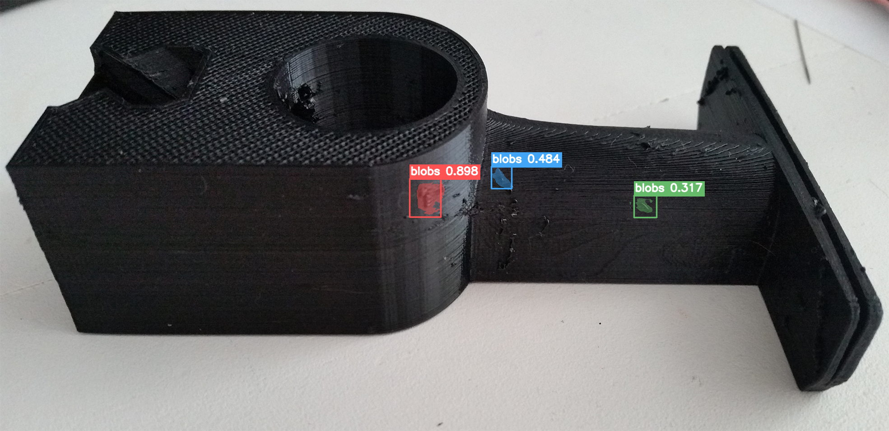
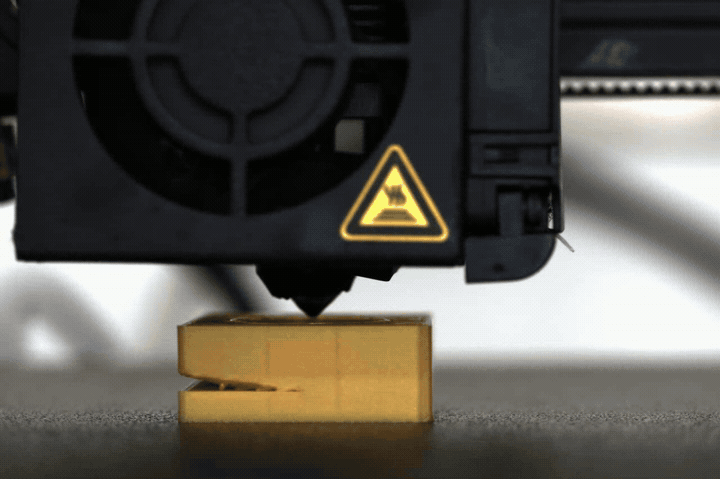

# 3D 打印缺陷检测与诊断 Agent

这是一个面向个人学术研究和非商业分享的离线 3D 打印缺陷检测项目。项目使用：

- LangGraph 编排确定性的检测、检索和回答流程；
- 自训练的 Ultralytics YOLO26 OBB 权重检测缺陷；
- SAM 2.1 根据检测框生成图片掩码或跟踪视频中的缺陷；
- BGE + BM25 + Qdrant 检索本地 3D 打印知识库；
- Qwen2.5-3B-Instruct 生成最终中文诊断。

Qwen 不负责猜测应该调用哪个视觉工具。媒体类型、图片/视频路由、失败处理和结果视频开关均由程序确定。

> Python 包名为 `langGraph`，命令行入口是 `python -m langGraph.agent`。

## 项目结构

```text
3Dprint_detectagent/
├── langGraph/                 # Agent、RAG、图片和视频工作流
├── dataset/image/             # 来自 Kaggle 的可选测试图片（非运行必需）
├── models/
│   ├── yolo/yolo_best.pt      # 本项目提供的自训练 YOLO26 OBB 权重
│   ├── sam/                   # 下载 SAM 2.1 Base+ 权重到这里
│   ├── bge/                   # 下载 BGE 权重到这里
│   └── Qwen/                  # 下载 Qwen2.5-3B-Instruct 权重到这里
├── sam2/                      # SAM 2.1 源码和 Hydra 配置
│   └── LICENSE                # SAM 2 官方 Apache 2.0 完整许可证
├── download_models.py         # 官方模型权重下载脚本
├── LICENSE                    # 项目原创代码的 AGPL-3.0 完整许可证
├── THIRD_PARTY_LICENSES.md    # 第三方组件许可说明
└── README.md
```

`dataset/image/` 只用于示例或测试，不是运行 Agent 的必要组件；来源及许可注意事项见 [dataset/README.md](dataset/README.md)。仓库不附带原始示例视频，README 仅保留用于结果展示的视频片段动图。

## 工作流

```text
用户请求
   |
   v
prepare_request
   |----------------------|----------------------|
   v                      v                      v
image_detection       video_detection       用户已给检测结果
(YOLO + SAM)              |                      |
                          v                      |
                 video_yolo_detection           |
                          |                      |
              有缺陷且要求结果视频？             |
                     | yes        | no           |
                     v            |              |
              video_sam_rendering |              |
                     |------------|--------------|
                                  v
                   retrieve_knowledge（BGE + BM25 + RRF）
                                  |
                                  v
                       generate_answer（本地 Qwen）
                                  |
                                  v
                  数值一致性校验；发现错误时按需重写
```

视频中的 `defect_count` 表示经过时序确认的缺陷事件数，而不是所有帧检测框的简单累加。完整逐帧结果保存在 `yolo_defect_events.json`；LangGraph 状态只保存可 JSON 序列化的摘要和文件路径。

## 结果展示

### 图片缺陷检测与分割

<p align="center">
  
</p>

### 视频缺陷检测与跟踪

以下动图截取自结果视频的第 19–22 秒：

<p align="center">
  
</p>

## 本地资源

代码不会在推理时联网。首次使用前需要把下列模型放到对应目录：

| 组件 | 状态 | 目标位置 | 官方来源 |
|---|---|---|---|
| YOLO26 OBB | 已包含，自训练权重 | `models/yolo/yolo_best.pt` | 使用 Ultralytics 框架训练，不由下载脚本覆盖 |
| Qwen2.5-3B-Instruct | 需要下载 | `models/Qwen/Qwen2.5-3B-Instruct/` | [Qwen 官方模型页](https://huggingface.co/Qwen/Qwen2.5-3B-Instruct) |
| BGE Small EN v1.5 | 需要下载 | `models/bge/bge-small-en-v1.5/` | [BAAI 官方模型页](https://huggingface.co/BAAI/bge-small-en-v1.5) |
| SAM 2.1 Hiera Base+ | 需要下载 | `models/sam/sam2.1_hiera_base_plus.pt` | [Meta SAM 2 官方仓库](https://github.com/facebookresearch/sam2) |
| Qdrant 数据库 | 已包含 | `langGraph/Qdrant_collection/` | 本项目的离线知识库 |
| BM25 词表 | 已包含 | `langGraph/Qdrant_collection/sparse/` | 与 Qdrant 集合配套 |

自动下载全部缺失的官方权重：

```bash
python download_models.py
```

先查看下载计划而不写入文件：

```bash
python download_models.py --dry-run
```

也可以只下载指定模型：

```bash
python download_models.py qwen bge
python download_models.py sam
```

脚本通过 Hugging Face 官方仓库下载 Qwen 和 BGE，通过 Meta 在 SAM 2 官方脚本中提供的地址下载 SAM 2.1 Base+。下载计划会显示每个模型的官方许可证链接；下载完成后，相应许可证副本会保存在模型目录中。重复运行会复用 Hugging Face 缓存并跳过已存在的文件；使用 `--force` 可重新下载。

如果自动下载失败，可以从上表的官方页面手动下载。目录可以保存模型文件本身，也可以使用 Hugging Face 的 `snapshots/<revision>` 布局，Agent 会自动寻找完整模型。

> 下载或使用任何模型即表示使用行为受该模型官方许可证约束；本项目保存的许可证副本不能替代官方条款。Qwen2.5-3B-Instruct 3B 权重采用 Qwen Research License，只允许非商业研究或评估用途。下载或使用前请阅读 [THIRD_PARTY_LICENSES.md](THIRD_PARTY_LICENSES.md)。

## 环境与依赖

推荐使用独立的 Python 虚拟环境：

```bash
python -m venv .venv
```

Linux/macOS：

```bash
source .venv/bin/activate
```

Windows PowerShell：

```powershell
.venv\Scripts\Activate.ps1
```

请先根据服务器的操作系统、GPU 和 CUDA 环境，从 [PyTorch 官方安装页面](https://pytorch.org/get-started/locally/) 安装匹配的 `torch` 和 `torchvision`。本项目验证过的环境是：

```text
Python 3.12.11
torch 2.10.0+cu128
torchvision 0.25.0+cu128
```

其余直接依赖如下：

```makefile
# LangGraph 工作流
langgraph==1.2.11

# RAG / Qdrant
langchain-core==1.6.1
qdrant-client==1.19.0
pydantic==2.13.5

# Qwen
transformers==5.9.0
safetensors==0.7.0
huggingface-hub==1.15.0

# YOLO / 图像和视频处理
ultralytics==8.4.7
opencv-python==4.12.0.88
numpy==2.0.1
Pillow>=9.4.0

# SAM2
hydra-core==1.3.2
omegaconf==2.3.0
iopath==0.1.10
tqdm==4.67.3
```

安装好匹配的 PyTorch/Torchvision 后，可以用下面的命令安装其余依赖：

```bash
python -m pip install -r requirements.txt
```

Ultralytics 8.4.7 的包元数据在部分平台上可能声明 `torch<2.10`，而上述验证环境使用了 PyTorch 2.10。若 pip 报版本冲突，应优先选择 PyTorch 官方支持且同时满足 Ultralytics 约束的 `torch`/`torchvision` 配套版本，然后重新进行完整冒烟测试，不建议使用 `--no-deps` 强行忽略依赖。

## 命令行运行

以下命令都应在 `3Dprint_detectagent` 根目录运行。

### 图片诊断

Windows PowerShell：

```powershell
python -m langGraph.agent `
  --prompt "请检测图片并分析。材料PLA，喷嘴0.4mm，喷嘴温度215C。" `
  --media-path "D:\data\part.jpg" `
  --llm-device cuda --vision-device cuda --rag-device cpu
```

Linux：

```bash
python -m langGraph.agent \
  --prompt '请检测图片并分析。材料PLA，喷嘴0.4mm，喷嘴温度215C。' \
  --media-path /data/part.jpg \
  --llm-device cuda --vision-device cuda --rag-device cpu
```

### 视频诊断

```bash
python -m langGraph.agent \
  --prompt '请检测视频并结合知识库分析。材料PLA，喷嘴0.4mm。' \
  --media-path /data/short_print.mp4 \
  --render-result-video \
  --llm-device cuda --vision-device cuda --rag-device cpu
```

视频诊断默认只运行 YOLO。只有传入 `--render-result-video`、检测成功且存在缺陷时，才加载 SAM 2.1 并输出掩码视频。

### 已有检测结果，仅进行知识检索和分析

```bash
python -m langGraph.agent \
  --prompt '检测结果发现2处拉丝，材料PLA，喷嘴温度220C，回抽距离0.8mm，请分析'
```

未传 `--prompt` 时进入交互模式：

```bash
python -m langGraph.agent
```

输入 `/exit` 退出。传入 `--json` 可输出完整 LangGraph 状态。

如需使用自定义 BGE 目录，可以附加：

```bash
--bge-model-path /path/to/bge-model
```

## Python 接入

```python
from langGraph import build_defect_agent

graph = build_defect_agent(
    llm_device="cuda",
    vision_device="cuda",
    rag_device="cpu",
    video_coarse_stride=7,
)

result = graph.invoke(
    {
        "user_query": "检测该视频并结合知识库分析，材料PLA，喷嘴0.4mm",
        "media_path": "/data/short_print.mp4",
        "render_result_video": True,
        "output_dir": "/data/results/job-001",
    }
)

print(result["final_answer"])
print(result.get("detection_result"))
print(result.get("sources"))
print(result.get("result_video_path"))
```

本地 Qdrant 存储不适合被多个进程同时写入或打开。部署为服务时，应在一个进程中复用同一组 `AgentServices`。

## 测试

单元测试不会加载大型模型：

```bash
python -m unittest discover -s langGraph/tests -v
```

真实视频冒烟测试请先截取数秒或几十帧，不要直接使用完整视频：

```bash
python -m langGraph.video.video_graph \
  /data/short_print.mp4 \
  --output-dir langGraph/runs/validation/video_subgraph \
  --render-result-video
```

若 SAM 2 提示本地扩展 `_C` 不可用，它会跳过可选的孔洞后处理；主体分割和视频传播仍可继续运行。

## 许可与用途

Copyright (c) 2026 xxy-502。

除另有明确标注的第三方材料外，本项目作者原创的源代码以 [GNU Affero General Public License v3.0 only（AGPL-3.0-only）](LICENSE) 授权，包括 `langGraph/` 中的项目代码和 `download_models.py`。通过网络向用户提供修改版或组合程序时，应特别注意 AGPL 第 13 节关于提供相应源代码的要求。

本项目定位为个人学术研究、教学演示和非商业分享；这是项目用途说明，不会对 AGPL-3.0 许可的原创代码增加“禁止商业使用”等额外限制。

顶层 `LICENSE` 不会重新授权第三方内容。`sam2/` 继续适用 Apache-2.0；Ultralytics YOLO26、相关训练代码及模型适用 Ultralytics 的 AGPL-3.0 或另行取得的企业许可；Qwen2.5-3B-Instruct 适用 Qwen Research License；BGE Small EN v1.5 适用 MIT License；数据集图片适用其来源页面及原始权利人的条款。完整边界和官方链接见 [THIRD_PARTY_LICENSES.md](THIRD_PARTY_LICENSES.md)。

因此，项目原创代码的 AGPL 授权不代表整个模型组合具有统一许可证。使用完整 Agent 前，使用者必须同时满足所有实际加载组件的许可证；商业或闭源使用尤其需要分别核查 Ultralytics 与 Qwen 条款。

本项目及模型输出按“现状”提供，不构成质量保证、工程认证或安全建议。使用者应自行核验检测与诊断结果。
